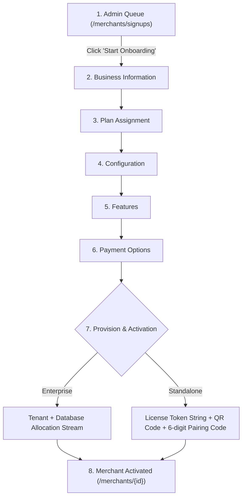

# Quantix Platform Admin - Complete Production Ready Merchant Onboarding Flow

> **Document Version:** 4.0.0  
> **Architecture Compliance:** Complies with `.agents/AGENTS.md` (Formik, Yup, RTK Query, ATM Components, Tailwind CSS, Feature-First Architecture)  
> **Application:** Quantix Platform Admin (`src/modules/merchants`)

---

## 1. Executive Summary & Flow Architecture Diagram

This document defines the **Complete End-to-End Merchant Onboarding Flow** implemented in `Quantix.PlatformAdmin` based on the platform architecture specification:



---

## 2. Step-by-Step Onboarding Specifications & File Mapping

### Step 1: Admin Queue (`/merchants/signups`)
- **Primary Component:** [SignupQueuePage.tsx](file:///d:/ForteckSolution/ApiWebService/Quantix_Platform_Website-main/Quantix.PlatformAdmin/Quantix.PlatformAdmin/src/modules/merchants/SignupQueue/SignupQueuePage.tsx)
- **Container Wrapper:** [SignupQueueWrapper.tsx](file:///d:/ForteckSolution/ApiWebService/Quantix_Platform_Website-main/Quantix.PlatformAdmin/Quantix.PlatformAdmin/src/modules/merchants/SignupQueue/SignupQueueWrapper.tsx)
- **Description:** Admin views pending merchant registrations submitted via public signup or sales entries.
- **Actions:**
  - **View:** Inspect applicant details.
  - **Start Onboarding:** Navigates to `/merchants/register/enterprise` or `/merchants/register/standalone` with candidate parameters pre-filled.
  - **Reject:** Marks registration entry as rejected with reason notes.

---

### Step 2: Business Information
- **Location:** Onboarding Wizard Step 1 / Compact Form Section 1.
- **Component File:** [RegisterEnterprisePage.tsx](file:///d:/ForteckSolution/ApiWebService/Quantix_Platform_Website-main/Quantix.PlatformAdmin/Quantix.PlatformAdmin/src/modules/merchants/RegisterEnterprise/RegisterEnterprisePage.tsx) & [RegisterStandalonePage.tsx](file:///d:/ForteckSolution/ApiWebService/Quantix_Platform_Website-main/Quantix.PlatformAdmin/Quantix.PlatformAdmin/src/modules/merchants/RegisterStandalone/RegisterStandalonePage.tsx)
- **Inputs & Fields:**
  - `Business Name` (`businessName`): Trade / Legal Name (Required, string, min 2)
  - `Category` (`businessNature`): Select from `Retail`, `Restaurant`, `Pharmacy`, `Services`, `E-Commerce`, `Custom`
  - `Merchant Type` (`merchantType`): Select `Enterprise` (Cloud Multi-Location) vs `Standalone` (Offline Token)
  - `Contact Person` (`contactPerson`): Primary Administrator Name
  - `Email` (`email`): Primary Contact Email
  - `Phone Number` (`phone`): Support & Contact Phone
  - `Street Address` (`addressLine1` & `addressLine2`): Physical Business Location
  - `City` (`city`): City Name
  - `State` (`state`): State / Province
  - `Country` (`country`): Select from `COUNTRY_OPTIONS` (US, GB, CA, AU, IN, AE, DE, FR, SA, SG)
  - `Postal Code` (`postalCode`): ZIP / Postal Code

---

### Step 3: Plan Assignment
- **Location:** Onboarding Wizard Step 2.
- **Constants File:** [constants.ts](file:///d:/ForteckSolution/ApiWebService/Quantix_Platform_Website-main/Quantix.PlatformAdmin/Quantix.PlatformAdmin/src/modules/merchants/Register/constants.ts)
- **Enterprise Plans:**
  - `Starter` ($49/mo): 1 Location, 2 Terminals, Basic Reports.
  - `Professional` ($129/mo, Popular): 3 Locations, 10 Terminals, Advanced Reports, Priority Support.
  - `Business` ($299/mo): 10 Locations, 50 Terminals, Custom Reports, Dedicated Support, Full API.
  - `Enterprise` (Custom): Unlimited Locations/Terminals, White Label, SLA, 24/7 Support.
- **Standalone Token Tiers:**
  - `Basic` ($19–$159): 1 Terminal, Basic Reports.
  - `Standard` ($39–$319): Up to 3 Terminals, Card Payments, Inventory.
  - `Advance` ($79–$649): Up to 10 Terminals, Multi-Location, Advanced Analytics.
  - `Premium` ($149–$1199): Unlimited Terminals, White-Label.

---

### Step 4: Configuration
- **Location:** Onboarding Wizard Step 3.
- **Inputs & Fields:**
  - `Support Number` (`supportPhone`): Dedicated customer service phone hotline for POS operations.
  - `Support Email` (`supportEmail`): Support email address for store operations.
  - `Terminal Count` (`maxTerminals`): Requested total POS terminal count.
  - **Enterprise Specific:**
    - `DB Engine` (`dbEngine`): Select `PostgreSQL` (Enterprise Grade), `MySQL`, `SQL Server`, or `SQLite`.
  - **Standalone Specific:**
    - `License Validity` (`initialTokenValidityDays`): Select `30`, `60`, `90`, `180`, or `365` Days.

---

### Step 5: Features (Module Enablement Toggles)
- **Location:** Onboarding Wizard Step 4.
- **Toggle Controls:**
  - ✅ **POS (Point of Sale):** Core checkout & register functionality.
  - ✅ **Inventory:** Stock management, low stock alerts, product catalog.
  - ✅ **CRM:** Customer profiles, purchase history, loyalty tiers.
  - ✅ **Loyalty:** Rewards points, discounts & promo campaigns.
  - ✅ **Reports:** Advanced sales, tax & inventory analytics.
  - ✅ **Vendors:** Supplier purchasing & purchase orders.
  - ✅ **Employees:** Staff management, roles & clock-in/out.
  - ✅ **QR Ordering:** Digital QR code table/counter ordering.
  - ✅ **API:** Webhooks & REST API access.

---

### Step 6: Payment
- **Location:** Onboarding Wizard Step 5.
- **Options:**
  - 💳 **Online Payment:** Instant Credit Card / Payment Gateway capture (`PaymentCaptureDto`).
  - 📝 **Manual Payment:** Invoice / Bank Transfer with Payment Bypass option (`POST /api/v1/merchants/{id}/bypass-payment`).
- **Billing Frequency:** Select `Monthly`, `Quarterly` (5% discount), or `Annual` (15% discount).

---

### Step 7: Provision & Activation
- **Location:** Onboarding Execution Step 6.
- **Execution Path by Merchant Type:**

#### For Enterprise Merchants:
1. **Tenant & DB Provisioning:** Allocates database tenant, applies schema migrations (`POST /api/v1/registration/{merchantId}/provision`). Animated progress stream (`idle` ➔ `provisioning` ➔ `done` / `error`).
2. **Account Activation:** Calls `POST /api/v1/merchants/{id}/activate`.
3. **Welcome Kit:** Dispatches welcome email credentials and opens active Merchant Profile (`/merchants/{id}`).

#### For Standalone Merchants:
1. **License Token Generation:** Generates RSA signed cryptographic token string and QR code SVG (`POST /api/v1/merchants/standalone`).
2. **Pairing Code:** Generates 6-Digit Terminal Pairing Code for offline POS hardware.
3. **Download & Activation:** Provides Download License JSON button, emails license key, and activates account.

---

## 3. Formik & Yup Master Validation Schema

```typescript
import * as Yup from 'yup';

export const merchantOnboardingValidationSchema = Yup.object().shape({
  // Business Information
  businessName: Yup.string().trim().min(2).max(200).required('Business name is required'),
  contactPerson: Yup.string().trim().min(2).max(100).required('Contact person is required'),
  email: Yup.string().trim().email('Invalid email address').required('Email is required'),
  phone: Yup.string().trim().min(6).max(20).required('Phone number is required'),
  addressLine1: Yup.string().trim().required('Street address is required'),
  city: Yup.string().trim().required('City is required'),
  state: Yup.string().trim().required('State is required'),
  country: Yup.string().required('Country is required'),
  postalCode: Yup.string().trim().required('Postal code is required'),
  merchantType: Yup.string().oneOf(['Enterprise', 'Standalone']).required('Merchant type is required'),
  category: Yup.string().required('Business category is required'),

  // Plan Assignment
  plan: Yup.string().required('Plan selection is required'),

  // Configuration
  supportPhone: Yup.string().trim().required('Support number is required'),
  supportEmail: Yup.string().trim().email('Invalid support email').required('Support email is required'),
  terminalCount: Yup.number().min(1, 'At least 1 terminal required').max(999).required('Terminal count is required'),
  dbEngine: Yup.string().when('merchantType', {
    is: 'Enterprise',
    then: (schema) => schema.oneOf(['PostgreSQL', 'MySQL', 'SQLServer', 'SQLite']).required('Database engine is required'),
  }),
  validityDays: Yup.number().when('merchantType', {
    is: 'Standalone',
    then: (schema) => schema.oneOf([30, 60, 90, 180, 365]).required('License validity is required'),
  }),

  // Payment
  paymentType: Yup.string().oneOf(['Manual', 'Online']).required('Payment type is required'),
  billingFrequency: Yup.string().oneOf(['Monthly', 'Quarterly', 'Annual']).required('Billing cycle is required'),
});
```

---

## 4. Module Directory Structure & Code Mapping

```
src/modules/merchants/
├── SignupQueue/
│   ├── SignupQueuePage.tsx               # Admin queue table with View, Start Onboarding, Reject actions
│   └── SignupQueueWrapper.tsx            # Data container & RTK Query handler
├── RegisterEnterprise/
│   ├── RegisterEnterprisePage.tsx        # Multi-step Enterprise wizard UI
│   ├── RegisterEnterpriseWrapper.tsx     # State controller & DB provisioning stream
│   └── index.ts
├── RegisterStandalone/
│   ├── RegisterStandalonePage.tsx        # Multi-step Standalone wizard UI (Token & QR Code generator)
│   ├── RegisterStandaloneWrapper.tsx     # State controller & token generation logic
│   └── index.ts
├── Form/
│   ├── EnterpriseRegisterForm.tsx        # Compact full enterprise form layout
│   └── StandaloneRegisterForm.tsx        # Compact full standalone form layout
├── Register/
│   └── constants.ts                      # Shared options, steps, plans, tiers & pricing
├── components/
│   ├── ActivationStep.tsx                # Activation status visualizer
│   ├── StepProgress.tsx                  # Horizontal step indicator bar
│   ├── TypeCard.tsx                      # Enterprise vs Standalone selector card
│   ├── PlanCard.tsx                      # Pricing plan selector cards
│   ├── OnboardingChecklist.tsx           # Checklist widget
│   └── WelcomeCommunications.tsx         # Welcome Email & SMS dispatch
└── services/
    └── merchantApi.ts                    # RTK Query API endpoints
```

---

## 5. API Endpoints Reference Table

| Endpoint Path | Method | Purpose / Description | Request Payload |
| :--- | :--- | :--- | :--- |
| `/api/v1/signups/queue` | `GET` | Fetch pending registration list for Admin Queue | Query params |
| `/api/v1/merchants/enterprise` | `POST` | Create & Onboard Enterprise Merchant | `MerchantCreateEnterprise` |
| `/api/v1/merchants/standalone` | `POST` | Create & Onboard Standalone Merchant | `MerchantCreateStandalone` |
| `/api/v1/registration/{merchantId}/provision` | `POST` | Trigger Tenant + DB Provisioning stream | Path: `merchantId` |
| `/api/v1/registration/payment` | `POST` | Process Online Payment capture | `PaymentCaptureDto` |
| `/api/v1/merchants/{id}/activate` | `POST` | Final Account Activation call | Path: `id` |
| `/api/v1/merchants/{id}/reject` | `POST` | Reject pending signup entry | Path: `id` |
